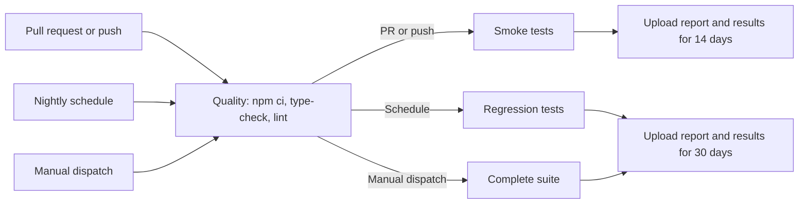

# EventHub Automation Project Guide

This guide explains how the EventHub Playwright framework is organized, how it creates and cleans test data, which scenarios it covers, why the tests can run in parallel, and how the GitHub Actions pipeline executes the suite.

## 1. Project at a glance

| Area | Current implementation |
| --- | --- |
| Test runner | Playwright Test |
| Language | TypeScript with strict type checking |
| Browser project | Chromium using the Desktop Chrome device profile |
| API testing | Playwright `APIRequestContext` through typed domain clients |
| UI testing | Page Object Model with accessible locators |
| Test data | A unique user and unique domain records generated at runtime |
| Parallel execution | Enabled for all tests with a two-worker remote-service safety cap |
| Retries | Two retries after the initial attempt |
| Main CI | GitHub Actions quality, smoke, and regression jobs |
| Current suite | 44 tests: 9 smoke and 35 regression |

The framework is hybrid: it uses fast API calls for setup and direct API coverage, while Page Objects own UI behavior. This keeps UI tests focused on what a user sees instead of spending time creating prerequisite data through the browser.

## 2. Repository structure

```text
.
├── playwright.config.ts             Playwright projects, workers, retries, and artifacts
├── src/
│   ├── core/
│   │   ├── config/env.ts             Environment validation
│   │   ├── types/domain.ts           Shared request and response types
│   │   └── utils/                     Unique user, event, and booking builders
│   ├── domain/
│   │   ├── api/                       HTTP transport and typed domain clients
│   │   └── fixtures/test.ts           Test setup, authentication, ownership, and cleanup
│   └── ui/pages/                      Page Objects for browser behavior
├── tests/
│   ├── api/                           API contracts and business rules
│   └── ui/                            User-visible browser behavior
├── docs/                              Framework and application documentation
└── .github/workflows/playwright.yml   Main CI test pipeline
```

### Ownership by layer

- `src/core/` contains shared configuration, types, and data builders. It does not perform UI or API operations.
- `src/domain/api/` owns HTTP calls. Tests do not build endpoint URLs or authorization headers themselves.
- `src/domain/fixtures/` owns test lifecycle: creating users, creating events, authenticating, and cleaning resources.
- `src/ui/pages/` owns routes, locators, browser actions, and page-specific assertions.
- `tests/api/` and `tests/ui/` describe business behavior and delegate implementation details to fixtures, clients, and Page Objects.

This separation makes tests readable and gives each type of change one natural location.

## 3. What happens when a test runs

A typical authenticated test follows this lifecycle:

```text
Playwright selects a test
        |
        v
Generate unique credentials
        |
        v
Register the user through the API
        |
        v
Create an authenticated API client
        |
        +-----------------------+
        |                       |
        v                       v
Create an owned event      Log in through the UI
        |                       |
        +-----------+-----------+
                    v
              Execute the test
                    |
                    v
       Passing test: delete owned data
       Failing test: retain scoped data for diagnosis
```

Playwright resolves only the fixtures requested by a test. For example, a public health test needs `api` only, while a booking UI test requests `authenticatedPage`, `authenticatedCredentials`, and `ownedEvent`, which causes their dependencies to run automatically.

## 4. Configuration and local setup

The framework requires two environment variables:

| Variable | Purpose |
| --- | --- |
| `BASE_URL` | Browser-facing EventHub application origin |
| `API_URL` | EventHub service origin used by API clients and setup fixtures |

`TEST_EMAIL` and `TEST_PASSWORD` are optional fields in the environment model. The current isolated tests generate their own credentials and do not depend on a shared account.

For local execution, create the ignored `.env` file from the committed template:

```bash
cp .env.example .env
```

The Playwright configuration loads `.env` during startup and fails immediately if `BASE_URL` or `API_URL` is missing. `.env` is ignored by Git so local values and future secrets are not committed.

Useful commands:

```bash
npm ci
npx playwright install chromium
npm run typecheck
npm run lint
npm test
npm run test:smoke
npm run test:regression
npx playwright test --headed --workers=2
npm run report
```

Use one equals sign in worker options: `--workers=2`, not `--workers==2`.

## 5. Test-data strategy

### 5.1 Data is generated per test

The builders in `src/core/utils/` create runtime data:

- `uniqueSuffix()` combines the current timestamp with a random base-36 string.
- `uniqueUser()` uses that suffix in the email and password.
- `uniqueEvent()` uses a new suffix in the event title and supplies a complete event payload.
- `bookingInput()` receives the owned event ID, a unique suffix, and the quantity being tested.

Example shapes are conceptually similar to:

```text
User email:  pw-<timestamp>-<random>@example.test
Event title: Automation event <timestamp>-<random>
Booking email: booking-<test-specific-suffix>@example.test
```

Tests therefore do not require a pre-existing user, event, booking, or execution order.

### 5.2 Fixture responsibilities

The custom fixtures are defined in `src/domain/fixtures/test.ts`.

| Fixture | Setup | Value supplied to the test | Teardown |
| --- | --- | --- | --- |
| `api` | Reads `API_URL` | Unauthenticated `EventHubApi` | Playwright disposes the request context |
| `credentials` | Calls `uniqueUser()` | Unique email and password | None required |
| `authenticatedApi` | Registers `credentials` and extracts the token | Token-authenticated `EventHubApi` | None required |
| `ownedEvent` | Creates a unique event with `authenticatedApi` | Created `EventRecord` | On success, deletes its bookings and then the event |
| `authenticatedPage` | Ensures the user exists, opens login, signs in, and waits for navigation | Logged-in Playwright `Page` | Browser context is disposed by Playwright |
| `authenticatedCredentials` | Reuses `credentials` | Credentials for UI form data | None required |

Fixtures are test-scoped by default. A fixture instance and its generated values belong to one test, not to the whole worker or suite.

### 5.3 Resource ownership and cleanup

The ownership rule is simple: the test or fixture that creates a resource is responsible for it.

- `ownedEvent` creates one event for one test.
- After a successful test, it lists bookings belonging to the authenticated user.
- It filters the list to bookings whose `eventId` matches the owned event.
- It deletes those bookings before deleting the event, respecting the domain dependency.
- It never deletes resources with unrelated event IDs.

Bookings associated with `ownedEvent` are left to its centralized teardown, including repeated submissions and boundary bookings. A test that creates an additional event outside the fixture uses guarded `try/finally` cleanup, as demonstrated by the direct creation and deletion scenarios.

Data from a failed test is intentionally retained. That preserves the server state needed to investigate the failure, and `ownedEvent` attaches its non-secret ID and title as `owned-event.json`. Because every later test generates different identifiers, retained failure data does not become shared input for another test. A consequence is that failed runs may leave scoped records that eventually need controlled maintenance cleanup.

### 5.4 Authentication data

Registration is centralized in `authenticatedApi`:

1. Generate unique credentials.
2. Call `POST /auth/register`.
3. Accept either `token` or `accessToken` from the response.
4. Create a new API facade with the bearer token.

`authenticatedPage` depends on `authenticatedApi`. That dependency makes sure registration finishes before the Page Object performs UI login with the same credentials.

Tokens and passwords are not printed or stored in source control. The API facade creates a new authenticated client instead of mutating the shared unauthenticated client.

## 6. API-client design

`BaseApi` is the shared transport. It:

- combines `API_URL` with a relative endpoint;
- adds a bearer token only when one exists;
- sends request data through Playwright's request context;
- converts non-success responses into `ApiError` with an HTTP status;
- returns parsed JSON for successful responses.

`EventHubApi` composes four domain clients:

| Client | Operations used by the suite |
| --- | --- |
| `AuthApi` | Register, log in, read current user |
| `EventsApi` | List, create, read, update, and delete events |
| `BookingsApi` | List, create, read by ID/reference, and delete bookings |
| `PublicApi` | Health and public configuration |

The event and booking clients validate important response fields and normalize numeric IDs to strings. They also accept known response variants such as a bare object or a `{ data: ... }` envelope. This keeps response compatibility logic out of the tests.

### Safe authentication recovery

`getEventWithRecovery()` handles one specific case:

1. Attempt an event read.
2. If the result is not HTTP 401, return it or rethrow the original error.
3. On HTTP 401, log in once with the supplied credentials.
4. Retry the event read once with the fresh token.

Only this idempotent read is replayed. Registration, booking, creation, update, and deletion operations are never automatically replayed by the API helper because doing so could create duplicate or destructive side effects.

## 7. UI and synchronization strategy

Page Objects hide locators and browser mechanics from the test files:

| Page Object | Responsibility |
| --- | --- |
| `LoginPage` | Open login, submit credentials, and assert success or invalid-credential behavior |
| `RegisterPage` | Submit registration and assert success, password mismatch, or weak-password behavior |
| `EventsPage` | Open event discovery, locate an owned semantic event card, and navigate to its details |
| `EventDetailsPage` | Assert event data, validate booking fields, submit a ticket, and open My Bookings |
| `BookingsPage` | Assert protected access, owned bookings, cancellation, and empty state |

`HomePage` currently models only the verified unauthenticated root state. Live verification found that `/` renders the sign-in experience and does not expose the previously assumed accessible Browse Events CTA, so no false CTA test is retained.

Locators prefer accessible roles and user-facing names. This tests the interface in a way close to how a user or assistive technology sees it and avoids styling classes, generated IDs, XPath, and layout-dependent selectors.

The project does not use `waitForTimeout` or arbitrary sleeps. Synchronization comes from:

- Playwright locator auto-waiting;
- visibility and URL assertions;
- registering a response listener before an action;
- waiting for the `/auth/login` response;
- waiting for the route to leave `/login` after successful authentication.

This is important for parallel and CI stability because fixed sleeps behave differently on fast and slow machines.

## 8. Current test-case inventory

### 8.1 API tests

| Feature | Count | Covered scenarios |
| --- | ---: | --- |
| Authentication | 7 | Registration identity; successful login and `/auth/me`; unauthenticated `/auth/me`; invalid credentials; weak password; duplicate email; one safe read after HTTP 401 |
| Events | 14 | Exact create/persistence; owned collection listing; update persistence; delete then exact 404; unauthenticated list/read/create/update/delete; cross-user mutation protection; blank title, past date, negative price, and zero-seat creation validation; invalid update with unchanged-state verification |
| Bookings | 11 | Full create/list/read/cancel lifecycle; reads by ID/reference; missing and cross-user read contracts; seat reduction/restoration; exact-capacity and sold-out behavior; zero/negative/fractional quantities; blank customer fields; missing event; unauthenticated operations; cross-user visibility/cancellation; repeated submissions |
| Public service | 2 | Exact health status/database/timestamp contract and public explore-link configuration |

The API layer contains 34 tests: 5 smoke and 29 regression.

### 8.2 UI and hybrid tests

| Feature | Count | Covered scenarios |
| --- | ---: | --- |
| Authentication | 5 | Successful login; successful registration; invalid login; password mismatch; weak password |
| Event discovery | 1 | Find the exact owned event and open its exact details route |
| Event booking | 2 | Assert event details, book, verify My Bookings, cancel, and confirm empty state; reject blank fields and malformed email without creating a booking |
| My Bookings | 2 | Empty state for a new user; unauthenticated redirect to login |

The UI layer contains 10 tests: 4 smoke and 6 regression.

### Smoke versus regression

Smoke tests answer: "Is the critical product path alive?" They cover fast, high-value behavior such as health, registration, login visibility, event reads, discovery, and booking.

Regression tests answer: "Do boundaries and broader business rules still behave correctly?" They cover validation, authorization, expired sessions, persistence, duplicates, capacity, missing resources, and authenticated-area access.

Tags are part of each test title, so Playwright can select them with `--grep` through the package scripts.

## 9. How full parallel execution works

`fullyParallel: true` allows Playwright to schedule individual tests in parallel, including tests from the same file. Parallel safety is achieved by the framework design rather than by timing or locks.

### The isolation guarantees

1. **Every test has unique credentials.** Parallel tests do not log in as the same user.
2. **Every owned event has a unique title and ID.** Tests do not update or delete a shared event.
3. **Bookings reference the current test's event.** Cleanup filters bookings by that event ID.
4. **Fixtures are test-scoped.** Authenticated clients and pages are not shared between tests.
5. **Setup uses APIs.** Creating prerequisites is fast and does not compete for shared browser state.
6. **Tests do not rely on order.** Any test can run first, last, by itself, or on a retry.
7. **There are no hardcoded waits.** Each worker waits for observable application state.
8. **Failed data is not reused.** A retry creates a fresh user and resources instead of inheriting the failed attempt's mutable state.

### Worker behavior

- Locally and in CI, the project defaults to two workers because the shared remote API was verified to drop mutation connections under four-worker load.
- `npx playwright test --workers=2` keeps two tests eligible to run concurrently while respecting that service limit.
- `--headed` shows browsers but does not disable parallelism; multiple browser windows may open.
- A larger CLI override is possible, but it is not recommended against the shared EventHub environment.

Full parallelism does not mean all 44 tests always execute at the same instant. It means they are eligible for independent scheduling within the available worker pool.

## 10. Retries and failure artifacts

The configuration uses `retries: 2`. A failing test can therefore run at most three times: the initial attempt plus two retries.

| Artifact | Policy |
| --- | --- |
| Console reporter | List each test and its result during execution |
| HTML report | Written to `playwright-report/` |
| Test output | Written under `test-results/` |
| Screenshot | Captured on failure |
| Trace | Captured on the first retry |
| Video | Captured on the first retry |

Retries are a suite-level safety net, not hidden recovery logic. The only application-level retry is the single safe event read after HTTP 401. Mutating API methods do not silently retry.

After a local run, open the HTML report with:

```bash
npm run report
```

For a trace attached to a failure:

```bash
npx playwright show-trace path/to/trace.zip
```

## 11. CI pipeline

The main workflow is `.github/workflows/playwright.yml`.



### Trigger matrix

| Trigger | Quality | Smoke | Regression |
| --- | --- | --- | --- |
| Pull request to `main` or `master` | Yes | Yes | No |
| Push to `main` or `master` | Yes | Yes | No |
| Nightly schedule at `02:00 UTC` | Yes | No | Yes |
| Manual `workflow_dispatch` | Yes | No separate job | Yes, as one complete-suite job |

### Quality job

The quality job:

1. Checks out the repository.
2. Sets up Node.js 22 with the npm cache.
3. Installs exact lockfile dependencies with `npm ci`.
4. Runs `npm run typecheck`.
5. Runs `npm run lint`.

Smoke and regression/full-suite jobs declare `needs: quality`, so tests do not start if compilation or linting fails.

### Smoke and regression jobs

Each test job runs on a fresh Ubuntu runner and:

1. Checks out the same commit.
2. Sets up Node.js 22 with npm caching.
3. Installs exact dependencies with `npm ci`.
4. Validates that GitHub variables `BASE_URL` and `API_URL` are non-empty.
5. Installs Chromium and its operating-system dependencies.
6. Runs smoke for PRs/pushes, regression for the schedule, or the complete suite for manual dispatch.
7. Uploads `playwright-report/` and `test-results/` even if tests fail.

The endpoints come from GitHub Actions repository or environment **variables** named `BASE_URL` and `API_URL`. Credentials or tokens, if introduced later, should be stored as GitHub **secrets**, not variables and never in the workflow file.

Smoke jobs have a 30-minute timeout and keep artifacts for 14 days. Regression jobs have a 60-minute timeout and keep artifacts for 30 days.

Both remote-test jobs share one GitHub Actions concurrency group, preventing overlapping workflow runs from exceeding the remote service's safe aggregate load.

There is currently no deployment stage. This is a continuous-integration validation pipeline, not a continuous-deployment pipeline.

### Copilot setup workflow

`.github/workflows/copilot-setup-steps.yml` is separate from the main product test pipeline. It prepares a coding-agent environment by installing dependencies and Playwright browsers, then running type checking and linting. It runs manually or when that workflow file itself changes.

## 12. How to add a new test safely

1. Decide whether the behavior is an API contract or user-visible UI behavior.
2. Search for an existing builder, fixture, API method, or Page Object before creating one.
3. Use a fixture for setup data. Do not depend on records already present in the environment.
4. If new data is required, generate a unique value and define who owns cleanup.
5. Put endpoint behavior in a domain client and browser behavior in a Page Object.
6. Use observable state, response predicates, and assertions instead of sleeps.
7. Add `@smoke` only for a fast critical path; otherwise use `@regression` for boundaries and broader coverage.
8. Confirm the test can run alone, with four workers, and in the relevant tagged suite.
9. Run the quality checks and the smallest relevant test command.

Example validation sequence:

```bash
npm run typecheck
npm run lint
npx playwright test path/to/new.spec.ts
npx playwright test path/to/new.spec.ts --workers=2 --retries=0
```

## 13. Common troubleshooting

### Missing `BASE_URL` or `API_URL`

Cause: `.env` is absent or one of the required values is empty.

```bash
cp .env.example .env
```

Then rerun the test command.

### A UI test redirects to login

Inspect the login API response and the URL transition first. `LoginPage.signInAs()` deliberately fails on a non-success login response, and `authenticatedPage` waits until the route leaves `/login`.

### A test passes alone but fails in parallel

Look for shared mutable data, a hardcoded ID/email/title, cleanup outside the current event ID, dependence on test order, or UI state stored beyond test scope. Reducing the worker count can confirm contention, but isolation should be fixed instead of permanently serializing the suite.

### A failure occurs only in CI

Check, in order:

1. The quality job result.
2. The CI configuration validation step.
3. The first failed test rather than later dependent-looking noise.
4. The uploaded screenshot, first-retry trace, video, and HTML report.
5. Differences in endpoint availability, runner performance, and service rate limits.

## 14. Related source-of-truth documents

- `docs/framework-map.md` describes framework ownership and fixture capabilities.
- `docs/application-map.md` records routes, endpoints, and stable locator contracts.
- `docs/test-data-and-auth.md` records isolation, cleanup, authentication, and synchronization rules.
- `skills.md` defines the broader planner, generator, healer, quality, CI, retry, and artifact policies.

Update those focused maps when an application contract or framework policy changes. Update this guide when the overall workflow, test inventory, or CI behavior changes.
